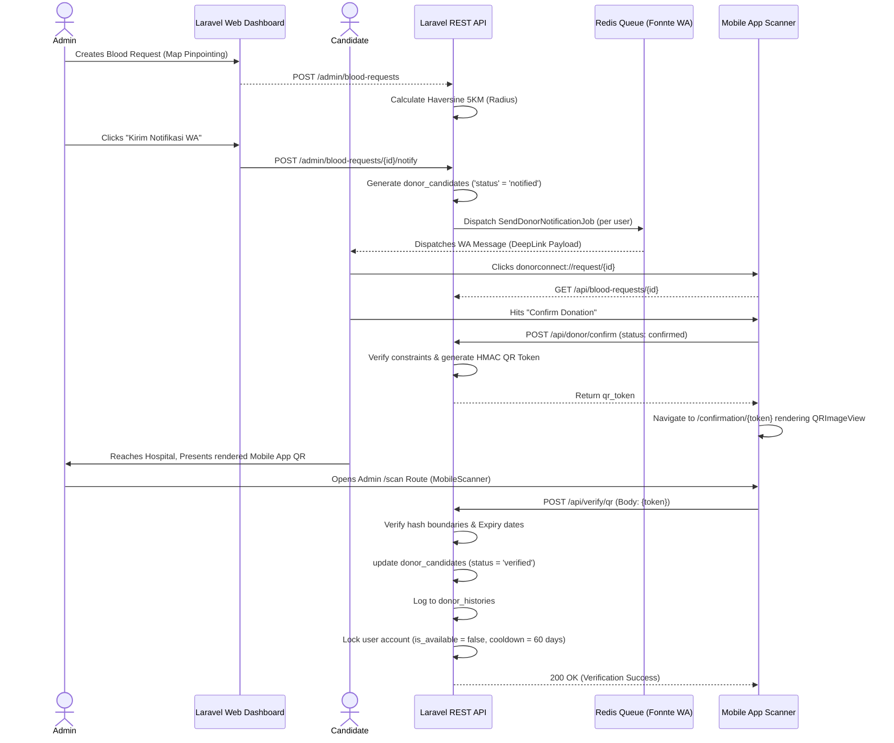

# Sequence Diagram Execution Matrix

This logical sequence maps the exact application lifecycle from emergency creation to final Verification limits.

```mermaid
sequenceDiagram
    actor Admin
    participant WebUI as Laravel Web Dashboard
    actor Donor as Candidate
    participant API as Laravel REST API
    participant Worker as Redis Queue (Fonnte WA)
    participant Flutter as Mobile App Scanner
    
    %% Phase 1: Request
    Admin->>WebUI: Creates Blood Request (Map Pinpointing)
    WebUI-->>API: POST /admin/blood-requests
    API->>API: Calculate Haversine 5KM (Radius)
    
    %% Phase 2: Interception
    Admin->>WebUI: Clicks "Kirim Notifikasi WA"
    WebUI->>API: POST /admin/blood-requests/{id}/notify
    API->>API: Generate donor_candidates ('status' = 'notified')
    API->>Worker: Dispatch SendDonorNotificationJob (per user)
    Worker-->>Donor: Dispatches WA Message (DeepLink Payload)
    
    %% Phase 3: Confirmation
    Donor->>Flutter: Clicks donorconnect://request/{id}
    Flutter-->>API: GET /api/blood-requests/{id}
    Donor->>Flutter: Hits "Confirm Donation"
    Flutter->>API: POST /api/donor/confirm (status: confirmed)
    
    %% Phase 4: Token Exchange
    API->>API: Verify constraints & generate HMAC QR Token
    API-->>Flutter: Return qr_token
    Flutter->>Flutter: Navigate to /confirmation/{token} rendering QRImageView
    
    %% Phase 5: Verification Scans
    Donor->>Admin: Reaches Hospital, Presents rendered Mobile App QR
    Admin->>Flutter: Opens Admin /scan Route (MobileScanner)
    Flutter->>API: POST /api/verify/qr (Body: {token})
    API->>API: Verify hash boundaries & Expiry dates
    
    %% Phase 6: Closure Limits
    API->>API: update donor_candidates (status = 'verified')
    API->>API: Log to donor_histories
    API->>API: Lock user account (is_available = false, cooldown = 60 days)
    API-->>Flutter: 200 OK (Verification Success)
```
