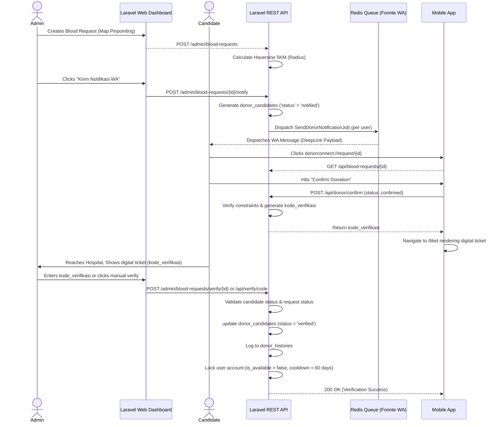
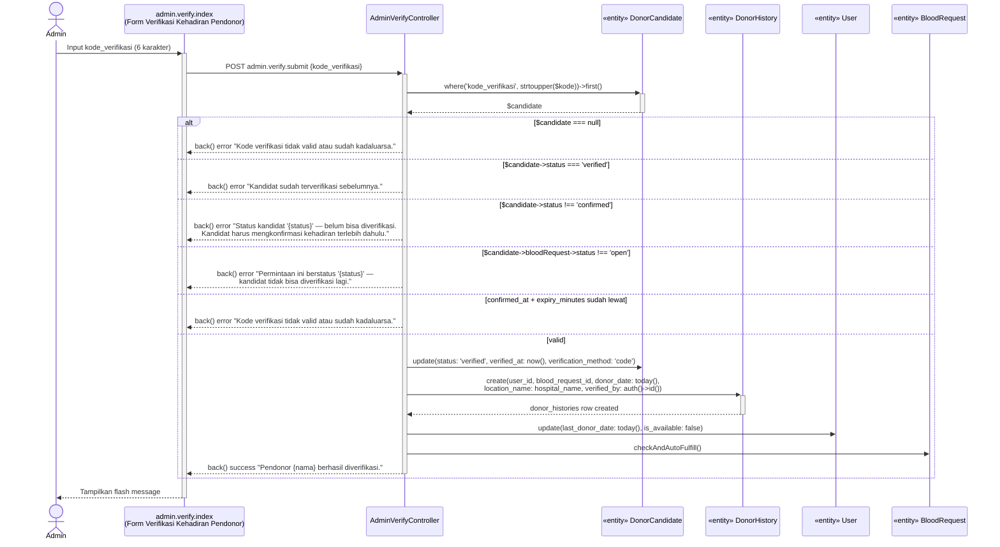
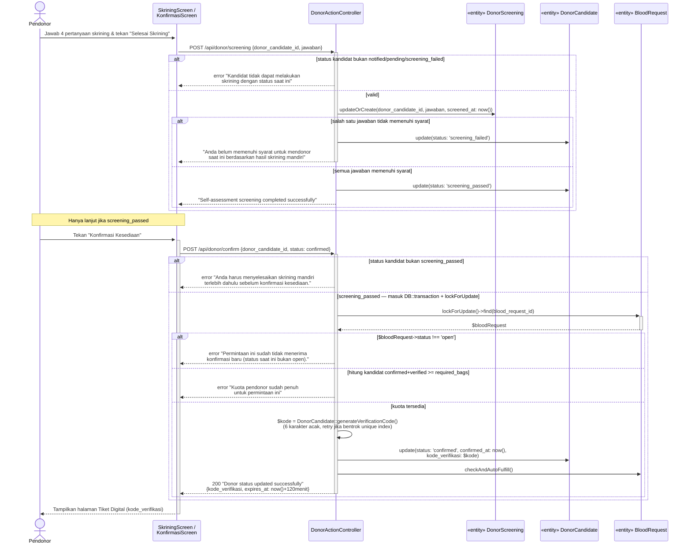

# Sequence Diagram Execution Matrix

This logical sequence maps the exact application lifecycle from emergency creation to final Verification limits.



## Sequence: Verifikasi Tiket Digital

Boundary/control/entity mengikuti nama kelas & pesan persis dari kode: view `resources/views/admin/verify/index.blade.php`, route `admin.verify.submit`, controller `AdminVerifyController::submit()`, model `DonorCandidate` / `DonorHistory` / `User` / `BloodRequest`. Tidak ada scan QR camera di sistem ini — kolom `qr_token` sempat ada lalu di-drop (migrasi `drop_qr_token_from_donor_candidates`), diganti kode teks 6 karakter `kode_verifikasi`.



## Sequence: Membuat Pengajuan Permintaan (Keluarga → Admin Approve)

Sisi Flutter: boundary `AjukanPermintaanScreen`, control `PermintaanProvider.submitPermintaan()` lewat `ApiService`, endpoint `ApiConstants.bloodRequests` (`POST /user/blood-requests`), controller `UserBloodRequestController::store()`. Sisi admin: boundary halaman `blood-requests.pending`, controller `AdminBloodRequestWebController::approve()`. Entity keduanya `BloodRequest`.

```mermaid
sequenceDiagram
    actor Keluarga as Keluarga (role: user)
    participant Boundary1 as AjukanPermintaanScreen
    participant Control1 as PermintaanProvider
    participant API as UserBloodRequestController
    participant Entity as «entity» BloodRequest
    actor Admin
    participant Boundary2 as blood-requests.pending<br/>(Halaman Pengajuan Keluarga)
    participant Control2 as AdminBloodRequestWebController

    Keluarga->>+Boundary1: Isi form & tekan "Kirim Pengajuan"
    Boundary1->>+Control1: submitPermintaan(bloodType, rhesus, requiredBags,<br/>patientName, patientRelationship, hospitalName,<br/>hospitalAddress, urgencyLevel, deadline, notes, lat, lng)
    Control1->>+API: POST /user/blood-requests

    alt validasi gagal (StoreBloodRequestRequest rules)
        API-->>Control1: 422 Unprocessable Entity
        Control1-->>Boundary1: error ?? "Gagal mengirim pengajuan"
    else validasi lolos
        API->>Entity: create(..., type: 'emergency', status: 'pending_review',<br/>requested_by_user_id: user.id, admin_id: null)
        API-->>-Control1: 201 "Pengajuan berhasil dikirim, menunggu persetujuan admin PMI"
        Control1-->>-Boundary1: success = true
        Boundary1-->>-Keluarga: Snackbar "Pengajuan berhasil dikirim,<br/>menunggu persetujuan admin"
    end

    Note over Admin,Control2: Async — tidak ada trigger langsung dari pengajuan;<br/>admin memantau lewat pollPendingCount()

    Admin->>+Boundary2: Buka menu "Pengajuan Keluarga"
    Boundary2->>Control2: GET blood-requests.pending
    Control2->>Entity: where('status', 'pending_review')->paginate(10)
    Entity-->>Boundary2: daftar pengajuan
    Admin->>Boundary2: Review detail & tekan "Approve"
    Boundary2->>+Control2: POST blood-requests.approve {id}

    alt !$bloodRequest->isPendingReview()
        Control2-->>Boundary2: back() error "Pengajuan ini sudah berstatus '{status}' —<br/>tidak bisa disetujui lagi."
    else pending_review
        Control2->>Entity: update(status: 'open', admin_id: auth()->id())
        Control2-->>-Boundary2: redirect "Pengajuan disetujui dan masuk<br/>alur pencarian pendonor."
    end

    Boundary2-->>-Admin: Tampilkan hasil
```

## Sequence: Skrining Mandiri dan Konfirmasi Donor

Koreksi dari diagram lama yang menyebut QR code (`qr_token`, `hash_hmac('sha256', ...)`, `expires_at now()+2h`) — kolom itu **sudah di-drop dari sistem** (migrasi `drop_qr_token_from_donor_candidates`). Yang berjalan sekarang: dua endpoint terpisah — `POST /api/donor/screening` (self-assessment) lalu `POST /api/donor/confirm` (baru di sinilah `kode_verifikasi` 6-karakter acak diterbitkan, bukan hash/QR), keduanya di `DonorActionController`.


